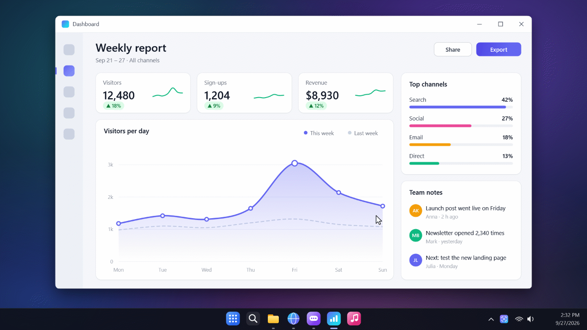
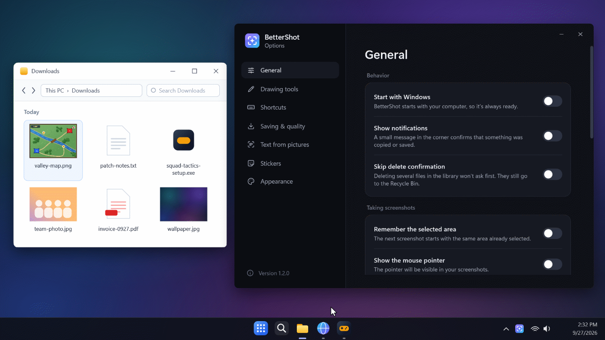
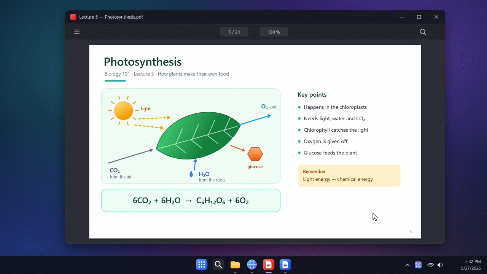
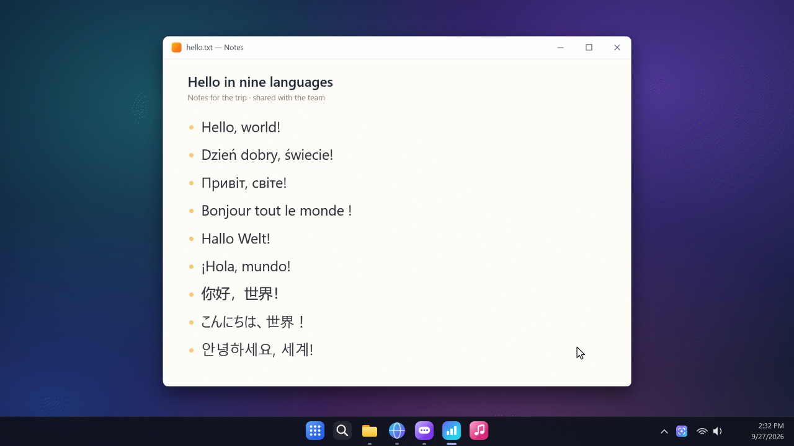
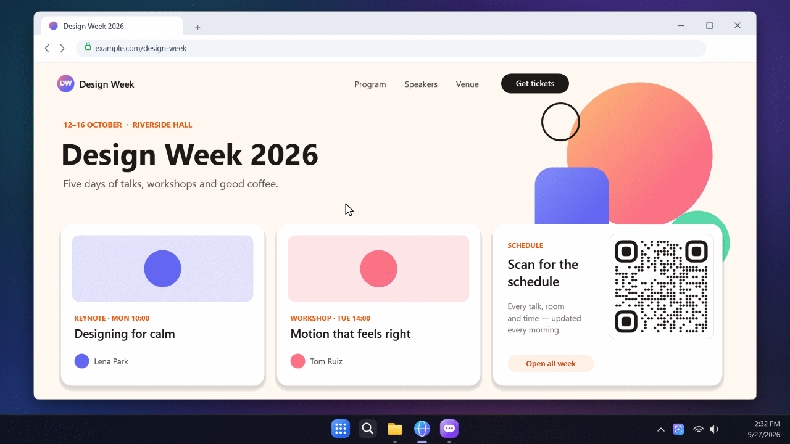
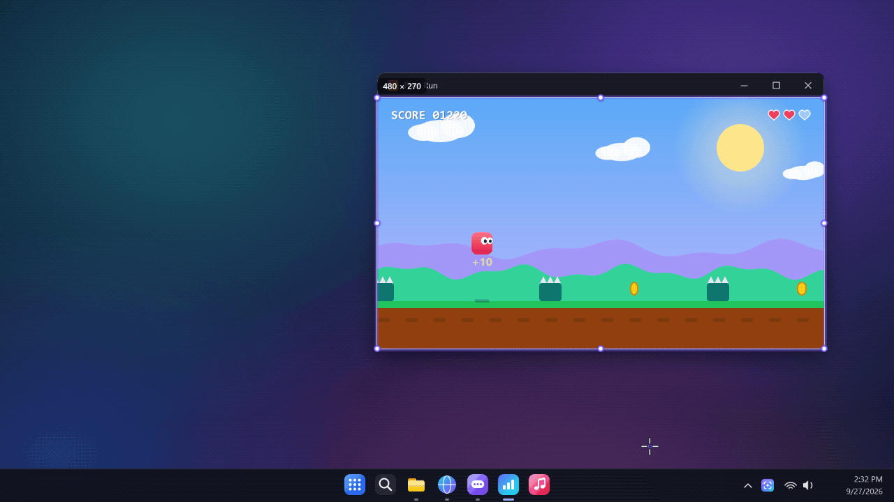
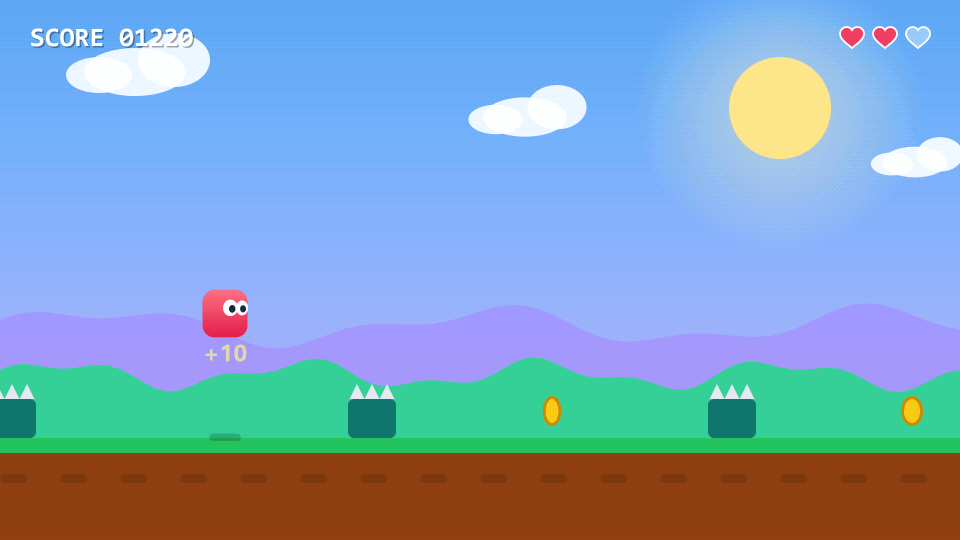
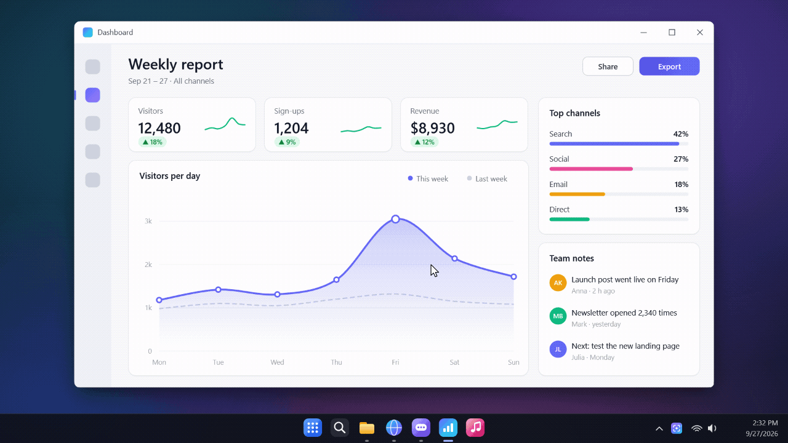
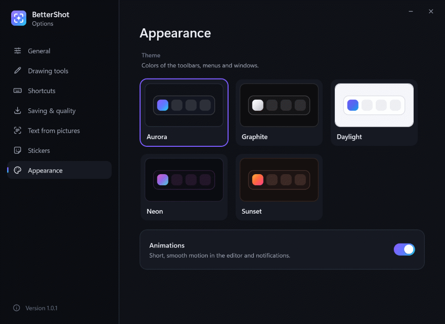

# BetterShot

**Screenshots at the speed of thought.** A modern screenshot tool for Windows 10 and 11: one file, nothing to install, fully offline.

**[Download BetterShot.exe](https://github.com/NemeWT10/BetterShot/releases/latest/download/BetterShot.exe)** · [All versions](https://github.com/NemeWT10/BetterShot/releases)

## Draw on your screenshots

Press `Ctrl+Shift+S`, select an area and add arrows, frames, captions or stickers. `Ctrl+C` copies it, ready to paste into Discord, a chat or a document.

## Stickers

Add your own pictures as stickers (say, a map from your game) and draw your plan right on it.

## Pin it on top

Click the pin (`Ctrl+P`) and the screenshot stays on top of every window, like a slide from the lecture while you write. Drag it, resize it with the mouse wheel or make it see-through.

## Copy text from any picture

Press `Ctrl+Alt+T`, select text on the screen and copy it, in English, Polish, Ukrainian, Chinese, Japanese, Korean and many more languages. It works offline.

## QR codes

Select a QR code and its link is ready to copy; nothing is opened. Turn it on in Options.

## Make GIFs

Record part of the screen (`Ctrl+Shift+G`), then trim it, change the speed, play it back and forth, add a caption and a color effect.

## Instant replay

`Ctrl+Shift+H` turns the last seconds into a GIF, even in a full-screen game, without leaving it. Turn it on in Options.

## Library

Your recent screenshots and GIFs in one place (`Ctrl+Shift+L`). Open one to edit it again, or pin it on top.

## Make it yours

Five themes, nine languages, and every shortcut can be changed in Options (`Ctrl+Shift+O`).

## Getting started

1. Download `BetterShot.exe` and run it. It waits in the tray, next to the clock.
2. The first time, Windows may show "Windows protected your PC". Click **More info → Run anyway**.
3. Press `Ctrl+Shift+S`, select an area, then press `Ctrl+C` to copy it.

BetterShot keeps itself up to date: a new version installs itself the next time BetterShot starts.

## Privacy

Everything stays on your computer. BetterShot only goes online to check for new versions, and you can turn that off in Options.

Built with .NET and ONNX Runtime (MIT). Text recognition uses PaddleOCR models (Apache 2.0).
